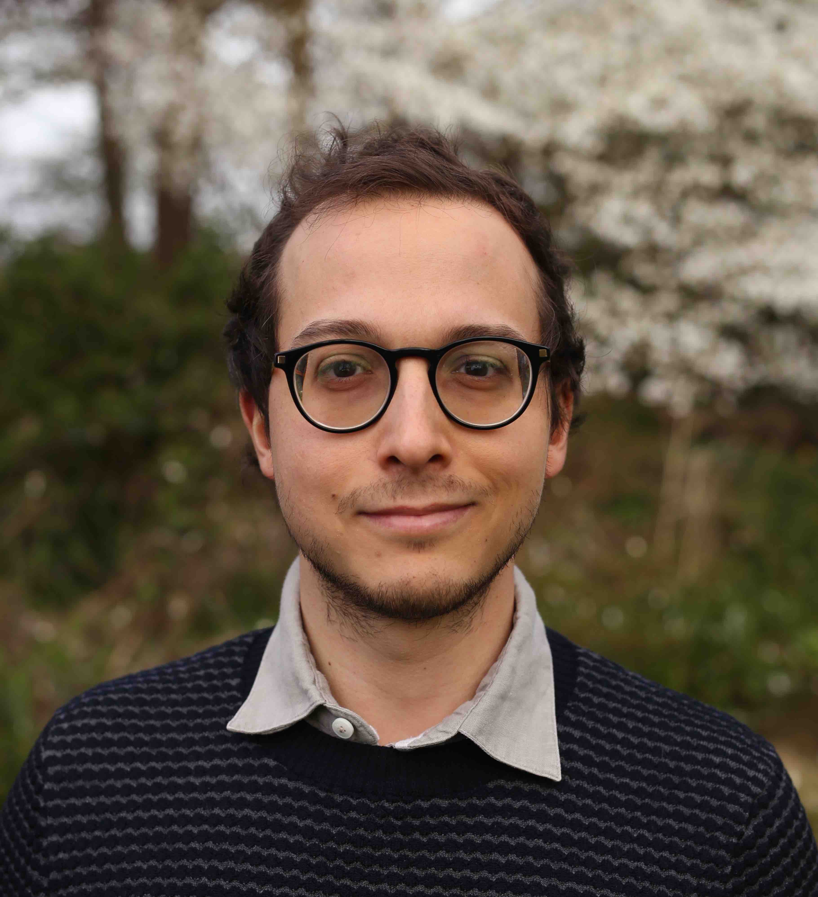

# Overview

  In the context of the 2022 Deep Learning Indaba this workshop will focus on computer vision algorithms using less labels and/or less data. 
Classically, machine learning relies on abundant annotated data. This is prone to cultural biases, since datasets are commonly recorded in western countries,  as well as distribution biais due to rare events, such as adverse weather/lighting conditions which are rarely included in public datasets. 

Speakers of this workshop will showcase recent researches on alternative strategies to reduce the need of labels (e.g., domain adaptation, domain generalization) or the need of data (e.g., few-/zero-shot learning, continual learning). Alternately, other strategies that rely on accessible priors will be presented, like self-supervised, cross modal, or model-based learning. The applications will focus, but not be limited to, autonomous driving and robotics.
  

<b>The workshop will have a poster session for selected works. Relevant original and/or published articles are welcome. See details in <a href="#call-for-papers">call for paper</a>.  

News (20/07): Last deadline extension ! 
News (10/07): Deadline is extended ! 
Submission website is open <a href="https://cmt3.research.microsoft.com/WSCV2022/" target="_blank">here</a> (deadline is July 10th July 31st) 
</b>

# Invited Speakers

  

    <a href="http://webia.lip6.fr/~cord/" target="_blank">
    
     
    Matthieu Cord</a> 
    Sorbonne Uni / Valeo.ai
  

  
  

  

  

    <a href="https://scholar.google.fr/citations?user=PXm1lPAAAAAJ" target="_blank">
    
     
    Gabriela Csurka</a> 
    Naver Labs Europe
  

  
  

  

  

    <a href="https://sites.google.com/site/sileyeoba/" target="_blank">
    
     
    Sileye Ba</a> 
    L'Oréal
  

  
  

  

  
  

    <a href="https://fcdl94.github.io/" target="_blank">
    
     
    Fabio Cermelli</a> 
    Politecnico di Torino
  

  

    <a href="https://umbertomichieli.github.io/" target="_blank">
    
     
    Umberto Michieli</a> 
    Samsung Research
  

  
  

  

  

    <a href="https://mysite.ku.edu.tr/fguney/" target="_blank">
    
     
    Fatma G&uuml;ney</a> 
    Koç University
  

## Program
The workshop will be half-day on 25/08 (2pm-6pm).

The program will be published soon.

<!--
:

| Time (CET) | Event |
| ----- | ----- |
| 14:00 | Opening remarks (10 min) |
| 14:10 | Invited talk 1 (50 min) |
| 15:00 | Invited talk 2 (30 min) |
| 15:30 | Invited talk 3 (30 min) |
| 16:00 | coffee break   (10 min) |
| 16:10 | Poster session (50 min) |
| 17:00 | Invited talk 4 (30 min) |
| 17:30 | Invited talk 5 (30 min) |
| 18:00 | End of the workshop |
//-->

## Organizers

  

    <a href="https://team.inria.fr/rits/membres/raoul-de-charette/">
    
     
    Raoul de Charette</a> 
    Inria
  

  
  

  

  

    <a href="https://fabvio.github.io/">
    
     
    Fabio Pizzati</a> 
    Inria and Unibo
  

  
  

  

  

    <a href="https://ptrckprz.github.io/">
    
     
    Patrick Pérez</a> 
    Valeo.ai
  

  
  

  

  

    <a href="https://tuanhungvu.github.io/">
    
     
    Tuan-Hung Vu</a> 
    Valeo.ai
  

  
  

    <a href="https://abursuc.github.io/">
    
     
    Andrei Bursuc</a> 
    Valeo.ai
  

  
  

  

  

    <a href="https://mancinimassimiliano.github.io/">
    
     
    Massimiliano Mancini</a> 
    Uni. of Tübingen
  

## Call for Papers

To foster interactions, attendees of the 2022 Deep Learning Indaba are invited to submit of any work related to computer vision (not limited to weakly supervised), for presentation at the poster session. 
Original articles as well as previously published ones can be submitted. 
 
Please submit pdf of your work on CMT: <a href="https://cmt3.research.microsoft.com/WSCV2022/" target="_blank">https://cmt3.research.microsoft.com/WSCV2022/</a> 
<b>Deadline is July 10th July 31st (11:59pm AOE).</b> 

 
The selection of relevant papers (of at least 4 pages) will be done by the organization board, for presentation at the poster session. 
 
The topics of interest include, but are not limited to:

  <ol>
    <li>3D computer vision</li>
    <li>Adversarial learning, adversarial attack for vision algorithms</li>
    <li>Autonomous agents with vision (reinforcement/imitation learning)</li>
    <li>Biometrics, face, gesture, body pose</li>
    <li>Computational photography, image and video synthesis</li>   
    <li>Explainable, fair, accountable, privacy-preserving, ethical computer vision</li>
    <li>Image recognition and understanding (object detection, categorization, segmentation, scene modeling, visual reasoning)</li>
    <li>Low-level and physics-based vision</li>
    <li>Semi-/Self-/Un-supervised learning and Few-/Zero-shot algorithms</li>
    <li>Transfer learning (domain adaptation, etc.)</li>
    <li>Video understanding (tracking, action recognition, etc.)</li>
    <li>Multi-modal vision (image+text, image+sound, etc.)</li>
  </ol>

<a href="https://drive.google.com/file/d/1ktqInynvEBldBYn-bg9SfZXjU5EWb-L7/view?usp=sharing" target="_blank">PDF version</a>

## Important workshop dates
- Submission deadline: July 10, 2022. Extended to July 20, 2022 <strong>Last extension to July 31st, 2022 (11:59pm AOE).</strong>
- Decision notification: <strong>August 4th, 2022.</strong>
- Workshop date: <strong>August 25, 2022.</strong> 

Any questions ? Contact <a href="https://team.inria.fr/rits/membres/raoul-de-charette/">Raoul de Charette</a>.
