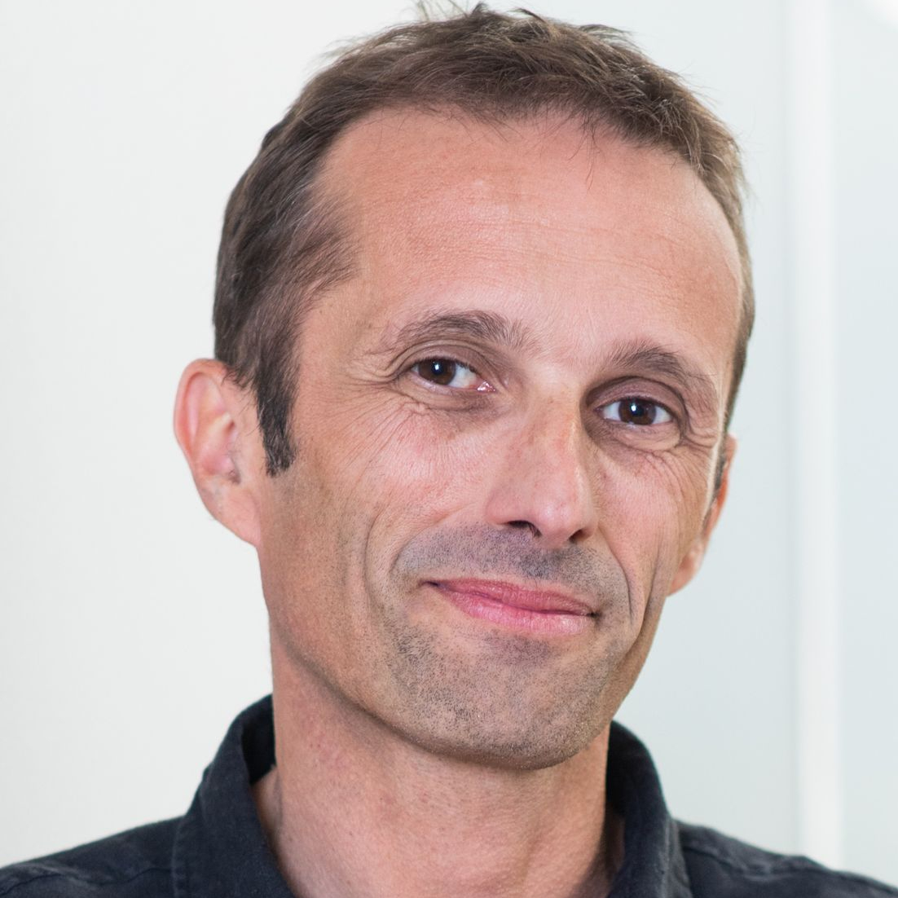

# Overview

This workshop will focus on computer vision algorithms using less labels and/or less data. 
Classically, machine learning relies on abundant annotated data. This is prone to cultural biases, since datasets are commonly recorded in western countries,  as well as distribution biais due to rare events, such as adverse weather/lighting conditions rarely included in datasets.

We will showcase recent researches on alternative strategies to reduce the need of labels (e.g., domain adaptation, domain generalization) or the need of data (few-/zero-shot learning, continual learning). Other strategies like self-supervised learning (cross modal, model-based), continual learning, etc. will be introduced. 
  

<b>The workshop will have a poster session for selected works. Relevant original and/or published works are welcome. 
Deadline for submissions is July 10th 2022 (<a href="#call-for-papers">call for paper</a>).</b>

# Invited Speakers

  TBA. 
  We're preparing a great set of speakers. <b>Stay tuned for updates.</b>

## Program
The workshop will be half-day on 25/08 (2pm-6pm).

The tentative program is:

| Time (CET) | Event |
| ----- | ----- |
| 14:00 | Opening remarks (10 min) |
| 14:10 | Invited talk 1 (40 min) |
| 14:50 | Invited talk 2 (30 min) |
| 15:20 | Invited talk 3 (30 min) |
| 15:50 | coffee break   (10 min) |
| 16:00 | Poster session (50 min) |
| 16:50 | Invited talk 4 (40 min) |
| 17:30 | Invited talk 5 (30 min) |
| 18:00 | End of the workshop |

## Organizers

  

    <a href="https://team.inria.fr/rits/membres/raoul-de-charette/">
    
     
    Raoul de Charette</a> 
    Inria
  

  
  

  

  

    <a href="https://fabvio.github.io/">
    
     
    Fabio Pizzati</a> 
    Inria and Unibo
  

  
  

  

  

    <a href="https://ptrckprz.github.io/">
    
     
    Patrick Pérez</a> 
    Valeo.ai
  

  
  

  

  

    <a href="https://tuanhungvu.github.io/">
    
     
    Tuan-Hung Vu</a> 
    Valeo.ai
  

  
  

  

  

    <a href="https://abursuc.github.io/">
    
     
    Andrei Bursuc</a> 
    Valeo.ai
  

## Call for Papers

To foster interactions and boost your visibility, we welcome submissions of any work related to computer vision (not limited to weakly supervised), to be presented at the poster session. 
Original articles as well as previously published works can be submitted. 
 
<b>Submission deadline is July 10th (11:59pm AOE). Details will be added here.</b> 
Selection of relevant papers (of at least 4 pages) will be done by the organization board, for presentation at the poster session. 
 
The topics of interest include, but are not limited to:

  <ol>
    <li>3D computer vision</li>
    <li>Adversarial learning, adversarial attack for vision algorithms</li>
    <li>Autonomous agents with vision (reinforcement/imitation learning)</li>
    <li>Biometrics, face, gesture, body pose</li>
    <li>Computational photography, image and video synthesis</li>   
    <li>Explainable, fair, accountable, privacy-preserving, ethical computer vision</li>
    <li>Image recognition and understanding (object detection, categorization, segmentation, scene modeling, visual reasoning)</li>
    <li>Low-level and physics-based vision</li>
    <li>Semi-/Self-/Un-supervised learning and Few-/Zero-shot algorithms</li>
    <li>Transfer learning (domain adaptation, etc.)</li>
    <li>Video understanding (tracking, action recognition, etc.)</li>
    <li>Multi-modal vision (image+text, image+sound, etc.)</li>
  </ol>

## Important workshop dates
- Submission deadline: <strong>July 10, 2022 (11:59pm AOE).</strong>
- Decision notification: <strong>July 20, 2022.</strong>
- Workshop date: <strong>August 25, 2022.</strong>